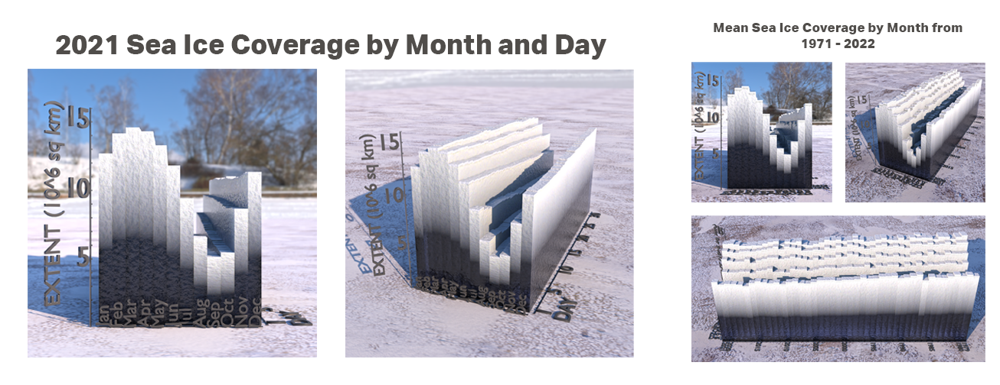
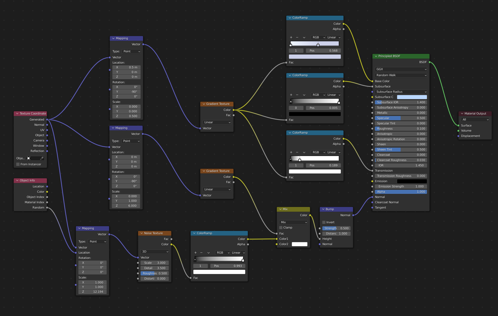
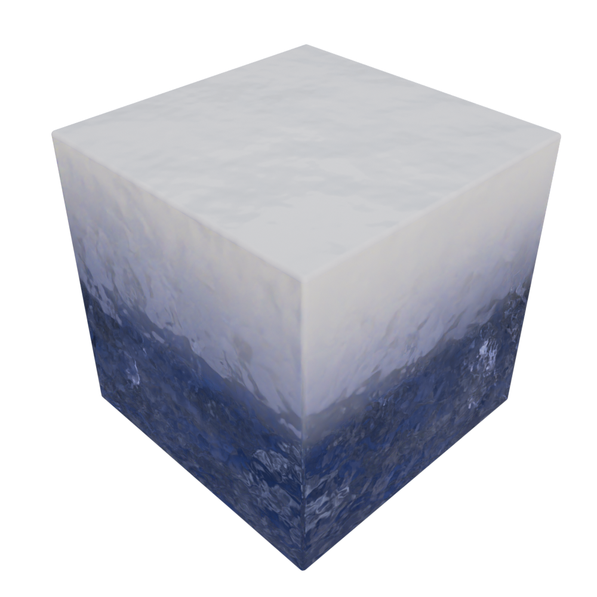

# **Sea Ice Visualization**    Created By Ethan Doyle 

### **Description:**  
The images above show a visualization of sea ice coverage taken from a dataset spanning from 1971 until 2022.  The goal of this project was to find a unique way to integrate computer science and 3D animation.  Blender is an open-source animation software that has integration with Python.  There were very few tutorials on using CSV data to generate geometry in Blender, so the techniques and methodology developed in this project are based upon a experimentation.  The steps below provide a detailed outline of how this project was completed. 

---

### **Software Used:**  

* Python
* Pandas (Python Package)
* Google Colaboratory
* Blender (Open Source 3D animation software)
* Adobe Photoshop
* [Dataset from National Snow & Ice Data Center](https://nsidc.org/data/nsidc-0051)

 

---
### **Instructions**

 

### ***Step 1:***
Create a notebook in Google Colaboratory, and clean Ice Data CSV using Pandas.  Then export cleaned data into two CSV files: Mean Ice Coverage of each month for years from 1979 until 2022, and the data from 2021.
### ***Step 2:***
Write Python Scripts in the Blender text editor to read in CSV data and generate 3D geometry.  The generation of the geometry was accomplished by looping through the CSV and applying specific time information to the X & Y axes (e.g. X = Year and Y = Month) and the ice coverage was associated with the Z value.  Each line in the CSV would generate one 'bar' in the resulting graph.
### ***Step 3:***
Using *Shader Nodes* in Blender, a procedural ice texture was calculated and applied to the generated geometry.  Essentially, the shader nodes took in the generated coordinates and mapped different gradient textures onto the cube which affected Color, subsurface scattering, and transmission.  Then a randomly generated noise texture is applied as a normal map to give more depth to the generated texture.     
Procedural generation provides two main benefits:
1. It can be generated entirely within Blender and requires no outside resources
2. It can scale infinitely to adjust for the varying sizes of the generated geometry
 
 

| Node Setup in Blender  | Generated Texture  |
| :---  |    :----  | 
| |   | 

### ***Step 4:***
The rest of the project was straightforward. I manually set up the labels in Blender and optimized the render settings before rendering the resulting graphs. After rendering the graphs I adjusted them in Photoshop and created the final images.
